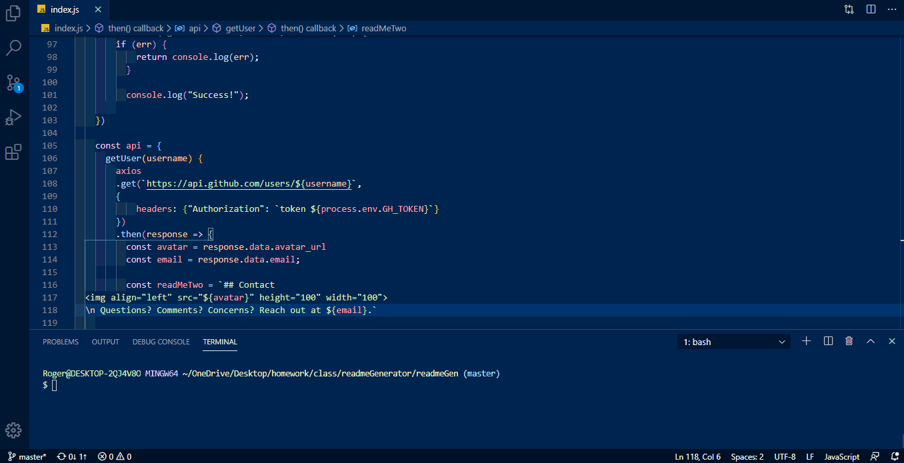

# readmeGen

## Description
* This is an app that creates README's so that developers can spend more time on their code.

## Installation
* To install the required packages for this application, run the following code: 
`npm install`

## Usage
* To use this application, type `node index` in the terminal, than answer the following questions to generate a new README.

## Technologies
* Node.js, Axios, Inquirer

## Contributors
@rogerson253

## Contact

#### Rogerson Jean-Charles (@rogerson253)
* Email: [rogerson253@gmail.com](rogerson253@gmail.com)
* LinkedIn: https://www.linkedin.com/in/rogerson-jean-charles253/

## License
MIT